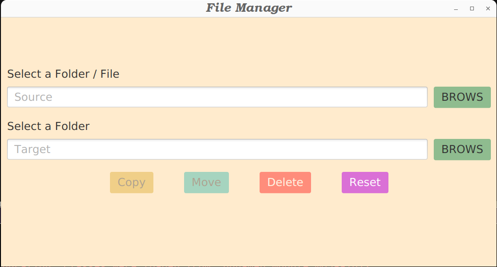
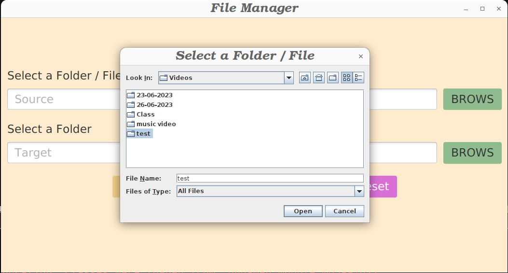
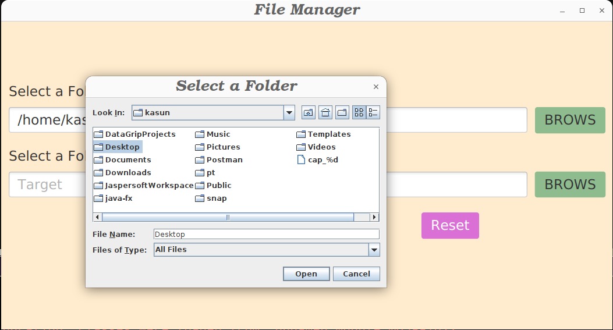
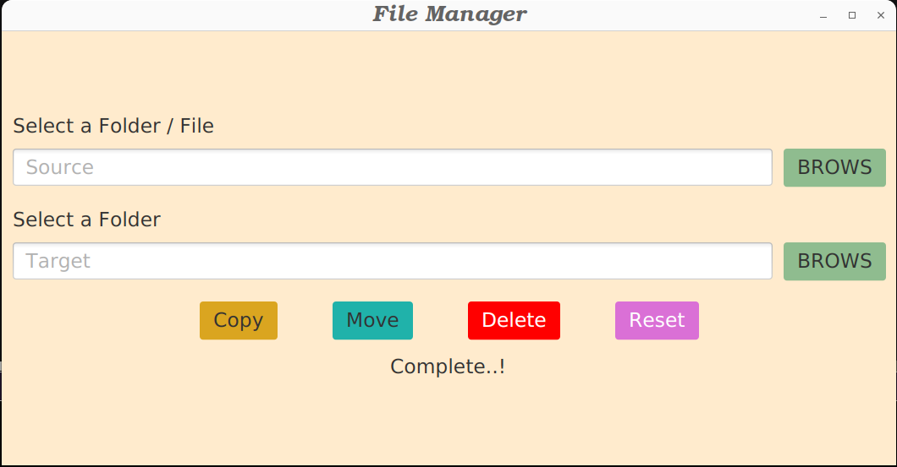

# Simple-File-Manager

The Simple File Manager is a desktop application designed to facilitate the management of files and folders. It has been developed using several technologies, including Java SE, JavaFX, and File I/O.

With this File Manager, you can perform essential file operations such as copying, moving, and deleting files and folders. Say goodbye to manual file organization and embrace a more efficient and streamlined approach.

## Technologies and Tools Used

- Java 11
- Java SE 11
- JavaFX
- File I/O

## Features

- Copy, Move and Delete files / Folders.

## Getting Started

To get started with the Simple-File-Manager application, follow these steps:

1. Clone the repository: `git clone https://github.com/KasunChathuranga3732/simple-file-manager.git`
2. Set up the necessary configurations.
3. Install the required dependencies and libraries.
4. Build and run the application.

## License

Copyright &copy; 2023. All Rights Reserved.

## Contact

For any inquiries or support, please contact [Kasun Chathuranga](mailto:kasunchathuranga3732@gmail.com).

## Screen Shots
### UI

### Select Source

### Select Target

### Complete Process

